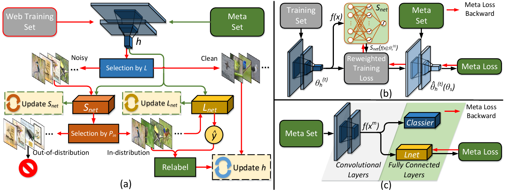

# Data-driven Meta-learning Based Fine-Grained Recognition

Introduction
------------
This is the source code for our paper **Data-driven Meta-learning Based Fine-Grained Recognition**

Network Architecture
--------------------
The architecture of our proposed peer-learning model is as follows


Installation
------------
After creating a virtual environment of python 3.7, run `pip install -r requirements.txt` to install all dependencies

How to use
------------
The code is currently tested only on GPU
* **Data Preparation**
    - Download web data into project root directory and uncompress them using
        ```
        wget https://wsnfg.oss-cn-hongkong.aliyuncs.com/web-bird.tar.gz
        wget https://wsnfg.oss-cn-hongkong.aliyuncs.com/web-car.tar.gz
        wget https://wsnfg.oss-cn-hongkong.aliyuncs.com/web-aircraft.tar.gz
        tar -xvf web-bird.tar.gz
        tar -xvf web-car.tar.gz
        tar -xvf aircraft-car.tar.gz
        ```
    - If you already have the benchmark datasets, you can directly use part of them as the validation sets.
    Otherwise, download validation data into project root directory and uncompress them using
        ```
        wget https://wsnfg.oss-cn-hongkong.aliyuncs.com/web-bird.tar.gz
        wget https://wsnfg.oss-cn-hongkong.aliyuncs.com/web-car.tar.gz
        wget https://wsnfg.oss-cn-hongkong.aliyuncs.com/web-aircraft.tar.gz
        tar -xvf val-bird.tar.gz
        tar -xvf val-car.tar.gz
        tar -xvf val-car.tar.gz
        ```
    
* **Source Code**

    - If you want to train the whole network from begining using source code on the web fine-grained dataset, please follow subsequent steps

      - Modify `CUDA_VISIBLE_DEVICES` to proper cuda device id and `data_base`, `val_base` to proper dataset in  ``` train.sh ```.
      You can directly utilize the benchmark dataset as the validation set by changing `meta_number` parameter in the ``` train.py ```. `meta_number` controls the number of images per category in the validation set, and it is set to be 10 by defaut.
      
      - Activate virtual environment(e.g. conda) and then run the script```bash train.sh``` to train the model. We recommand you to use resnet-18 backbone, because it needs less memory and time to train.
      
    
